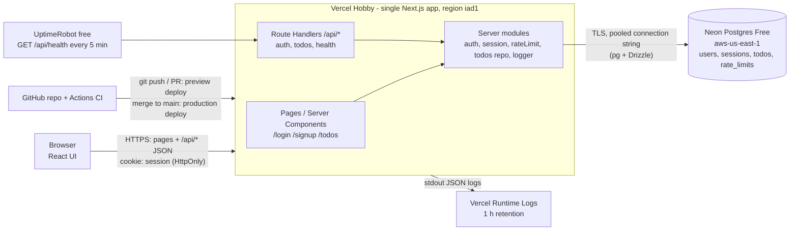
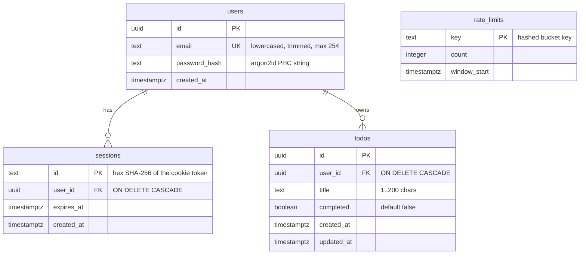

# Architecture
> Owner: architect · Status: Approved (Gate 2, 2026-10-03)

Product: "To-Do App" (placeholder name). Source of requirements: `docs/PRD.md` (Approved, Gate 1, 2026-10-03).
Screen flows and copy live in `docs/ux.md` (UX designer). Decisions are recorded in `docs/adr/0001` to `0004`.

## 1. Context & constraints (free-tier hosting, team = AI agents)

| Constraint | Source | Design consequence |
|---|---|---|
| Hosting and services cost USD 0/month | PRD G3, M5 | Vercel Hobby + Neon Free only. No paid add-ons, no Redis, no email provider. |
| Up to a few hundred users | PRD Q14 | One region, one app, one Postgres database. No caching layer, no queues. |
| Email + password auth; no reset, no verification | PRD US-1/2, Gate 1 | Auth built in-app; no email sending at all. |
| Password min 8 chars, no complexity rules | Gate 1 Q3 | Max 128 chars (to bound hashing cost). |
| 7-day session | Gate 1 Q4 | Server-side session row with absolute 7-day expiry. |
| Title 1 to 200 chars, trimmed | Gate 1 Q5 | Validated in API (Zod) and enforced by a DB CHECK constraint. |
| Strict per-user isolation | US-9, M2 | Every to-do query is scoped by `user_id` taken from the session, never from the client. |
| p95 under 500 ms for list/create/toggle | M4 | Function region co-located with the DB; small queries with indexes. See risk R2 (cold starts). |
| Builders and maintainers are AI agents | CLAUDE.md | One TypeScript codebase, mainstream libraries, explicit JSON API that is easy to test. |
| Delete asks for confirmation (no undo) | Gate 1 Q6 | Pure UI concern; API delete is a hard delete. |

Non-goals for the architecture: multi-region, horizontal scale beyond free tiers, background jobs, email, file uploads, analytics (M6 dropped).

## 2. Tech stack (with reason for each choice → see ADRs)

| Layer | Choice | Reason | ADR |
|---|---|---|---|
| Language | TypeScript (strict mode) | One typed language for UI, API and tests; catches contract mismatches at build time. | 0001 |
| Framework | Next.js 16 (App Router), single app containing UI and JSON API (Route Handlers) | Most widely documented full-stack React framework; one deployable; first-class on Vercel free tier. | 0001 |
| Runtime | Node.js 22 LTS runtime for all route handlers (not Edge) | Needed for argon2 native binding and the `pg` driver; avoids Edge CPU limits. | 0001, 0003 |
| UI | React 19 (bundled with Next.js) + Tailwind CSS 4 | Default `create-next-app` setup; no component library needed for 3 screens. | 0001 |
| Validation | Zod 4 | One schema shared by client forms and server handlers; produces field-level errors (US-1, US-4, US-7). | 0001 |
| Database | PostgreSQL 17 on Neon Free | Relational data with FK and unique constraints fits users/sessions/todos; generous permanent free tier. | 0002 |
| DB access | Drizzle ORM + `pg` (node-postgres) driver, `drizzle-kit` SQL migrations | Typed queries, plain SQL migrations committed to git; the same driver works against Neon and a local/CI Postgres container. | 0004 |
| Password hashing | Argon2id via `@node-rs/argon2` | OWASP-recommended algorithm; prebuilt binaries, works on Vercel Node functions. | 0003 |
| Sessions | Opaque random token in an HttpOnly cookie; SHA-256 of token stored in `sessions` table | Real server-side logout (US-3), simple to reason about and test, no JWT pitfalls. | 0003 |
| Rate limiting | Postgres-backed fixed-window counters (`rate_limits` table) | No extra service (Redis would add a vendor); load is tiny. | 0003 |
| Unit/integration tests | Vitest | Fast, TypeScript-native, Jest-compatible API. | 0001 |
| E2E tests | Playwright (Chromium in CI) | Mainstream, reliable auto-waiting; covers PRD acceptance criteria end to end. | 0001 |
| CI | GitHub Actions with a `postgres:17` service container | Free for this repo's usage level; real DB in tests (no mocks for data isolation tests). | 0002 |
| Hosting | Vercel Hobby (app) | Zero-config Next.js hosting, preview deploy per PR, free. Non-commercial only (see risk R1). | 0002 |
| Package manager | pnpm | Fast, strict dependency resolution, lockfile committed. | 0001 |

Nothing in this stack costs money at the expected scale. Items that would cost money are listed in section 7.

## 3. System diagram



ASCII equivalent:

```
Browser ──HTTPS──> Vercel (Next.js app: pages + /api route handlers + server modules) ──TLS/pg──> Neon Postgres
                         │                                                                      (users, sessions,
                         └──> Vercel runtime logs (JSON)                                         todos, rate_limits)
GitHub (PRs, Actions CI with postgres container) ──deploy──> Vercel
```

Request path for a to-do action: browser `fetch('/api/todos/...')` with the session cookie → route handler → `requireSession()` reads cookie, hashes token, looks up a non-expired session → todo repository runs a query that always includes `WHERE user_id = $sessionUserId` → JSON response.

## 4. Components & responsibilities

| Component | Location | Responsibility |
|---|---|---|
| Root page | `src/app/page.tsx` | Redirect to `/todos` if a valid session exists, otherwise to `/login`. |
| Auth pages | `src/app/(auth)/login/page.tsx`, `src/app/(auth)/signup/page.tsx` | Forms per `docs/ux.md`. Server component checks session and redirects already-logged-in users to `/todos`. Client form component posts JSON to `/api/auth/*`, shows field errors, then `router.replace('/todos')`. |
| To-do page | `src/app/todos/page.tsx` | Server component: `getSession()`; if none, `redirect('/login')` (US-2). Loads the initial list server-side, renders a client `TodoList` component that calls `/api/todos` for create/edit/toggle/delete. Sets `dynamic = 'force-dynamic'` and `Cache-Control: no-store` so back-button after logout cannot show cached data (US-3). |
| UI components | `src/components/` | `TodoList`, `TodoItem`, `NewTodoForm`, `ConfirmDeleteDialog`, `LogoutButton`, form field + error components. |
| API: auth | `src/app/api/auth/{signup,login,logout,me}/route.ts` | Thin handlers: check origin, parse JSON, validate with Zod, call `server/auth`, set or clear the cookie. |
| API: todos | `src/app/api/todos/route.ts`, `src/app/api/todos/[id]/route.ts` | Thin handlers: `requireSession()`, validate, call `server/todos`, map results to HTTP codes. |
| API: health | `src/app/api/health/route.ts` | Liveness (no DB). `?db=1` adds a `SELECT 1` readiness check (manual/deploy use only, see 9). |
| Auth service | `src/server/auth/` | `hashPassword`, `verifyPassword` (argon2id), `signUp`, `logIn`, `logOut`; constant-work login path for unknown emails. |
| Session service | `src/server/auth/session.ts` | `createSession(userId)`, `getSession()` (cookie → SHA-256 → DB lookup, deletes if expired), `requireSession()` (throws 401), `invalidateSession()`, cookie helpers. |
| Rate limiter | `src/server/rateLimit.ts` | `consume(key, limit, windowSeconds)` as a single atomic upsert; returns `{ allowed, retryAfterSeconds }`. |
| CSRF guard | `src/server/http/origin.ts` | `assertSameOrigin(request)` for every POST/PATCH/DELETE: `Origin` header must equal `APP_ORIGIN`. |
| Todo repository | `src/server/todos/repo.ts` | `listTodos(userId)`, `createTodo(userId, title)`, `updateTodo(userId, id, patch)`, `deleteTodo(userId, id)`. Every function takes `userId` as its first argument and scopes every SQL statement by it. No function in the codebase reads or writes a to-do without a `userId`. |
| Validation schemas | `src/lib/validation.ts` | Zod schemas shared by client and server: `signUpSchema`, `logInSchema`, `createTodoSchema`, `updateTodoSchema`, `todoIdSchema`. |
| API client | `src/lib/api.ts` | Typed `fetch` wrappers used by client components; throws a typed `ApiError` with `code` and `fields`. |
| DB | `src/server/db/{index.ts,schema.ts}`, `drizzle/` (migrations) | Drizzle schema, `pg` pool singleton, migrations as SQL files. |
| Env | `src/server/env.ts` | Zod-validated `process.env` at startup; app fails fast if a variable is missing. |
| Logger | `src/server/log.ts` | JSON-line logger with redaction (see 9). |
| Security headers | `next.config.ts` `headers()` | CSP and other headers (see 8). |

Folder structure:

```
.
├── .github/workflows/ci.yml        # lint, typecheck, unit+integration, e2e (DevOps)
├── .env.example                    # names only, no values
├── drizzle/                        # generated SQL migrations (committed)
├── drizzle.config.ts
├── next.config.ts                  # security headers
├── playwright.config.ts
├── vitest.config.ts
├── docker-compose.yml              # local postgres:17 for dev and tests
├── src/
│   ├── app/
│   │   ├── layout.tsx
│   │   ├── page.tsx
│   │   ├── (auth)/login/page.tsx
│   │   ├── (auth)/signup/page.tsx
│   │   ├── todos/page.tsx
│   │   └── api/
│   │       ├── auth/{signup,login,logout,me}/route.ts
│   │       ├── todos/route.ts
│   │       ├── todos/[id]/route.ts
│   │       └── health/route.ts
│   ├── components/
│   ├── lib/                        # shared client+server: validation.ts, api.ts, types.ts
│   └── server/                     # server-only (import 'server-only')
│       ├── auth/{password.ts,session.ts,service.ts}
│       ├── todos/repo.ts
│       ├── db/{index.ts,schema.ts}
│       ├── http/{origin.ts,errors.ts,json.ts}
│       ├── rateLimit.ts
│       ├── env.ts
│       └── log.ts
└── tests/
    ├── unit/                       # pure functions: validation, token hashing, error mapping
    ├── integration/                # route handlers against a real Postgres (incl. US-9 isolation)
    └── e2e/                        # Playwright, one spec per user story group
```

## 5. Data model

PostgreSQL. All IDs are UUID v4 generated by the database (`gen_random_uuid()`), so to-do IDs are not guessable; isolation does not rely on this (see 8.5). All timestamps are `timestamptz` in UTC.



DDL (reference; the real migration is generated by `drizzle-kit` from `src/server/db/schema.ts` and must be equivalent):

```sql
CREATE TABLE users (
  id            uuid PRIMARY KEY DEFAULT gen_random_uuid(),
  email         text NOT NULL,
  password_hash text NOT NULL,
  created_at    timestamptz NOT NULL DEFAULT now(),
  CONSTRAINT users_email_lowercase CHECK (email = lower(email)),
  CONSTRAINT users_email_length    CHECK (char_length(email) BETWEEN 3 AND 254)
);
CREATE UNIQUE INDEX users_email_key ON users (email);

CREATE TABLE sessions (
  id         text PRIMARY KEY,                       -- sha256(token) as 64 hex chars
  user_id    uuid NOT NULL REFERENCES users(id) ON DELETE CASCADE,
  expires_at timestamptz NOT NULL,
  created_at timestamptz NOT NULL DEFAULT now()
);
CREATE INDEX sessions_user_id_idx ON sessions (user_id);

CREATE TABLE todos (
  id         uuid PRIMARY KEY DEFAULT gen_random_uuid(),
  user_id    uuid NOT NULL REFERENCES users(id) ON DELETE CASCADE,
  title      text NOT NULL,
  completed  boolean NOT NULL DEFAULT false,
  created_at timestamptz NOT NULL DEFAULT now(),
  updated_at timestamptz NOT NULL DEFAULT now(),
  CONSTRAINT todos_title_length CHECK (char_length(title) BETWEEN 1 AND 200)
);
CREATE INDEX todos_user_created_idx ON todos (user_id, created_at DESC, id DESC);

CREATE TABLE rate_limits (
  key          text PRIMARY KEY,
  count        integer NOT NULL,
  window_start timestamptz NOT NULL
);
```

Rules:
- **Email normalisation:** trim, then lowercase, before validation and storage. Uniqueness is on the normalised value (US-1 duplicate check). The unique index is the source of truth; the handler maps a unique-violation (`23505`) to `409 EMAIL_TAKEN`, so concurrent duplicate sign-ups cannot create two accounts.
- **Title normalisation:** trim leading/trailing whitespace; length counted in Unicode code points (`[...title].length` in TS, `char_length` in Postgres, which agree). Empty after trim → error.
- **Ordering (US-5):** `ORDER BY created_at DESC, id DESC` (id breaks ties).
- **updated_at:** set by the repository on every update (no trigger, keep logic in one place).
- **Retention:** expired sessions are deleted when encountered and opportunistically on each login (`DELETE FROM sessions WHERE user_id = $1 AND expires_at < now()`); stale `rate_limits` rows are deleted on each login/sign-up attempt where `window_start < now() - interval '1 day'`. No cron needed.
- **Size estimate:** a few hundred users × even 1,000 to-dos × ~300 bytes is under 100 MB, well inside the Neon storage limit.

## 6. API contracts

Conventions:
- Base path `/api`. JSON only. Requests with a body must send `Content-Type: application/json` (otherwise `415 UNSUPPORTED_MEDIA_TYPE`).
- Authentication: `session` cookie (set by sign-up/login). The client never handles the token.
- All `POST`/`PATCH`/`DELETE` requests must carry an `Origin` header equal to `APP_ORIGIN`; otherwise `403 FORBIDDEN_ORIGIN` (CSRF defence, see 8.4).
- All responses: `Cache-Control: no-store`.
- Unknown JSON fields are rejected (`.strict()` Zod schemas) with `400 VALIDATION_ERROR`.
- Error envelope (every non-2xx response):

```json
{ "error": { "code": "VALIDATION_ERROR", "message": "Human-readable summary", "fields": { "title": "Title is required" } } }
```
`fields` is present only for `VALIDATION_ERROR`. Messages are safe to show to users; the exact UI copy is owned by `docs/ux.md` and the frontend may map `code`/`fields` to that copy.

Shared types:

```ts
type User = { id: string; email: string };
type Todo = { id: string; title: string; completed: boolean; createdAt: string; updatedAt: string }; // ISO 8601 UTC
```
`user_id` is never returned in a to-do.

Common error codes:

| HTTP | code | When |
|---|---|---|
| 400 | `VALIDATION_ERROR` | Body or path parameter fails Zod validation, or malformed JSON |
| 401 | `UNAUTHENTICATED` | Missing, unknown or expired session on a protected endpoint |
| 403 | `FORBIDDEN_ORIGIN` | Mutating request with missing or foreign `Origin` |
| 404 | `NOT_FOUND` | Resource does not exist **or belongs to another user** (indistinguishable on purpose) |
| 409 | `EMAIL_TAKEN` | Sign-up with an email that already has an account |
| 415 | `UNSUPPORTED_MEDIA_TYPE` | Body sent without `application/json` |
| 429 | `RATE_LIMITED` | Auth rate limit hit; includes `Retry-After` header (seconds) |
| 500 | `INTERNAL_ERROR` | Unexpected error; message is generic, details only in server logs with `requestId` |

### 6.1 `POST /api/auth/signup` (US-1)
Auth: none. Rate limited (8.6).

Request:
```json
{ "email": "sam@example.com", "password": "at-least-8-chars" }
```
Validation: `email` trimmed + lowercased, valid email format, max 254 chars. `password` 8 to 128 characters, not trimmed, any characters allowed.

Responses:
- `201 Created` + `Set-Cookie: session=...` (new session; user is logged in)
  ```json
  { "user": { "id": "3f0c...", "email": "sam@example.com" } }
  ```
- `400 VALIDATION_ERROR` with `fields.email` and/or `fields.password` (e.g. `"Enter a valid email address"`, `"Password must be at least 8 characters"`).
- `409 EMAIL_TAKEN` `{ "error": { "code": "EMAIL_TAKEN", "message": "An account with this email already exists", "fields": { "email": "An account with this email already exists" } } }` — required by US-1; reveals that an email is registered (accepted, see R5).
- `403`, `415`, `429`, `500` as above.

### 6.2 `POST /api/auth/login` (US-2)
Auth: none. Rate limited (8.6).

Request:
```json
{ "email": "sam@example.com", "password": "..." }
```
Validation: same shape as sign-up but only checks presence and max lengths (an 8-char rule is not applied at login, so the error stays generic).

Responses:
- `200 OK` + `Set-Cookie: session=...` → `{ "user": { "id": "...", "email": "..." } }`. Any existing session cookie on the request is invalidated first (session fixation defence).
- `401 INVALID_CREDENTIALS` → `{ "error": { "code": "INVALID_CREDENTIALS", "message": "Invalid email or password" } }` for unknown email **or** wrong password (identical body, status and comparable timing).
- `400 VALIDATION_ERROR` (missing fields / malformed JSON), `403`, `415`, `429`, `500`.

### 6.3 `POST /api/auth/logout` (US-3)
Auth: optional (idempotent). No body.

Responses:
- `204 No Content` + `Set-Cookie: session=; Max-Age=0; ...`. Deletes the session row if one exists. Returns 204 even without a valid session.
- `403 FORBIDDEN_ORIGIN`, `500`.

### 6.4 `GET /api/auth/me`
Auth: required. Used by the client to check login state.
- `200 OK` → `{ "user": { "id": "...", "email": "..." } }`
- `401 UNAUTHENTICATED`

### 6.5 `GET /api/todos` (US-5, US-9)
Auth: required. Returns only the caller's to-dos, newest first. No pagination in MVP (a few hundred items per user at most; see R6).
- `200 OK`
  ```json
  { "todos": [ { "id": "b1...", "title": "Buy milk", "completed": false, "createdAt": "2026-10-03T10:00:00.000Z", "updatedAt": "2026-10-03T10:00:00.000Z" } ] }
  ```
  Empty list → `{ "todos": [] }` (UI shows the empty state).
- `401 UNAUTHENTICATED`, `500`.

### 6.6 `POST /api/todos` (US-4)
Auth: required.

Request:
```json
{ "title": "Buy milk" }
```
Validation: `title` string; trimmed; 1 to 200 code points after trim.

Responses:
- `201 Created` → `{ "todo": Todo }` with `completed: false`.
- `400 VALIDATION_ERROR` → `fields.title`: `"Title is required"` (empty/whitespace) or `"Title must be 200 characters or fewer"`.
- `401`, `403`, `415`, `500`.

### 6.7 `PATCH /api/todos/:id` (US-6, US-7, US-9)
Auth: required. `:id` must be a UUID (else `404 NOT_FOUND`, so probing reveals nothing).

Request (at least one field; both allowed):
```json
{ "title": "Buy oat milk" }
{ "completed": true }
{ "title": "Buy oat milk", "completed": false }
```
Validation: `title` as in 6.6; `completed` boolean; empty object → `400 VALIDATION_ERROR`.

Behaviour: single statement `UPDATE todos SET ..., updated_at = now() WHERE id = $id AND user_id = $sessionUserId RETURNING *`. Zero rows → 404.

Responses:
- `200 OK` → `{ "todo": Todo }`
- `400 VALIDATION_ERROR` (old title is unchanged because nothing is written).
- `404 NOT_FOUND` (missing, or owned by another user; nothing is changed).
- `401`, `403`, `415`, `500`.

### 6.8 `DELETE /api/todos/:id` (US-8, US-9)
Auth: required. Confirmation happens in the UI before this call. Hard delete.

Behaviour: `DELETE FROM todos WHERE id = $id AND user_id = $sessionUserId`. Zero rows → 404.

Responses: `204 No Content`; `404 NOT_FOUND`; `401`, `403`, `500`.

### 6.9 `GET /api/health`
Auth: none.
- `200 OK` → `{ "status": "ok" }` (no DB access; used by uptime monitor).
- `GET /api/health?db=1` → `200 { "status": "ok", "db": "ok" }` or `503 { "status": "degraded", "db": "error" }`. Used after deploys and manually only.

### 6.10 Page routes (not JSON)
| Route | Unauthenticated | Authenticated |
|---|---|---|
| `/` | redirect `/login` | redirect `/todos` |
| `/login`, `/signup` | render form | redirect `/todos` |
| `/todos` | redirect `/login` (US-2) | render list |

## 7. Hosting & deployment (free tier services and their limits)

Limits verified on the vendors' sites on 2026-10-03. Free tiers change; DevOps should re-check before launch.

| Component | Service / plan | Free-tier limits that matter | Our expected use |
|---|---|---|---|
| App (UI + API) | **Vercel Hobby** | 1,000,000 function invocations/month; 4 h Active CPU/month; 360 GB-hrs provisioned memory; 100 GB Fast Data Transfer; 10 GB Fast Origin Transfer; function default max duration 10 s (configurable up to 60 s); 100 deployments/day; runtime logs kept **1 hour**; **non-commercial personal use only**; Git repo must be owned by a personal GitHub account, not an org (this repo is owned by a user account, so OK). | A few hundred users: well under 100k invocations/month. Argon2id hashing (~50 ms CPU each) on sign-up/login is the main CPU cost: 10,000 logins ≈ 8 CPU-minutes. |
| Database | **Neon Free** (Postgres 17) | 100 CU-hours per project per month; autoscaling up to 2 CU; scale-to-zero after 5 min idle (cannot be disabled); 1 GB storage per project (writes blocked above that; some third-party summaries still quote 0.5 GB, so plan for 0.5 GB); 5 GB public egress/month (compute suspends above that until next period); 10 branches; 6-hour history (PITR) window; no credit card; data is never deleted when limits are hit. | Configure compute **min 0.25 CU / max 0.5 CU** to protect CU-hours. Data under 100 MB. |
| Staging DB | Neon branch `staging` of the same project | Shares the project's 100 CU-hours and storage. | Preview deployments point at `staging`. |
| CI | **GitHub Actions** | Public repos: free. Private repos on GitHub Free: 2,000 minutes/month. | ~5 min per CI run; ~400 runs/month fit if the repo is private. |
| Uptime monitor | **UptimeRobot Free** (optional, SRE decides) | 50 monitors at 5-minute interval, no credit card. Sources disagree on whether commercial use is allowed (some report personal/non-commercial only since Oct 2024); same answer as Vercel (Q1). | 1 monitor on `/api/health` (no DB). |

**Regions:** Vercel function region `iad1` (Washington, D.C.) set in `vercel.json`; Neon project in `aws-us-east-1`. Co-location keeps DB round-trips at ~1–2 ms.

**Environments:**
| Env | App | DB | Trigger |
|---|---|---|---|
| Local | `pnpm dev` | `docker compose up db` (postgres:17) | developer |
| CI | `next build && next start` in Actions | `postgres:17` service container, fresh per run | every PR |
| Staging / preview | Vercel Preview deployment per PR | Neon branch `staging` | PR opened/updated |
| Production | Vercel Production | Neon branch `main` | merge to `main` after Gate 3; promotion after Gate 4 |

**Migrations:** `drizzle-kit generate` produces SQL in `drizzle/`, reviewed in the PR. Applied with `pnpm db:migrate` (runs `drizzle-kit migrate`) against staging and then production by DevOps as an explicit deploy step, never automatically at app start. Migrations must be additive/backward-compatible for the MVP. Rollback: Vercel "Instant Rollback" to the previous deployment; Neon 6-hour PITR / branch restore for data.

**Things that would cost money (flag to CEO before doing):**
- Any commercial use (ads, payments, paid client work) requires Vercel Pro (USD 20/user/month at time of writing). Alternative free host for commercial use: see R1.
- Exceeding Neon free limits does not bill (it suspends/blocks), but upgrading to lift limits is paid.
- Longer log retention, log drains and Vercel Observability Plus are paid features.
- Password-reset email (deferred) would need an email provider; several have free tiers, to be evaluated when that story is scheduled.

### Scaffold commands (for Tech Lead / developers)

```bash
# 1. App (TypeScript, ESLint, Tailwind, App Router, src/ dir, @/* alias)
pnpm create next-app@latest todo-app --ts --eslint --tailwind --app --src-dir --import-alias "@/*" --use-pnpm
# The app lives at the repo root: run the command in an empty temp dir and move its contents into the repo,
# or scaffold directly in the repo root with `pnpm create next-app@latest .` on a feature branch.

# 2. Runtime dependencies
pnpm add drizzle-orm pg zod @node-rs/argon2 server-only
# 3. Dev dependencies
pnpm add -D drizzle-kit @types/pg vitest @vitest/coverage-v8 @playwright/test prettier eslint-config-prettier tsx
pnpm exec playwright install --with-deps chromium

# 4. Local database
docker compose up -d db          # postgres:17, user/pass/db from .env (local values only)
pnpm db:generate                 # drizzle-kit generate
pnpm db:migrate                  # drizzle-kit migrate
```

`package.json` scripts to define: `dev`, `build`, `start`, `lint`, `typecheck` (`tsc --noEmit`), `format`, `test` (vitest run), `test:integration`, `test:e2e` (playwright test), `db:generate`, `db:migrate`.

`.env.example` (names only):
```
DATABASE_URL=            # Neon pooled connection string (host contains -pooler), sslmode=require; local: postgres://...
APP_ORIGIN=              # e.g. http://localhost:3000 locally; https://<prod-domain> in production
SESSION_COOKIE_SECURE=   # "true" in staging/production (defaults to true when NODE_ENV=production)
LOG_LEVEL=               # info | debug
```

## 8. Security (auth, secrets, data protection)

### 8.1 Passwords
- Argon2id via `@node-rs/argon2`, parameters per OWASP: `memoryCost: 19456` (19 MiB), `timeCost: 2`, `parallelism: 1`. Stored as the PHC string (includes salt and params) in `users.password_hash`.
- Password length 8 to 128 characters (upper bound limits hashing DoS). No complexity rules (Gate 1).
- Passwords are never logged, returned, or stored elsewhere. Request bodies of auth endpoints are never logged.
- Login for an unknown email still runs `verify` against a fixed dummy hash so response time does not reveal whether the account exists.

### 8.2 Sessions (ADR-0003)
- On sign-up/login: generate 32 bytes from `crypto.randomBytes` → base64url token. Store `sha256(token)` (hex) as `sessions.id` with `expires_at = now() + 7 days`. A database leak therefore does not leak usable tokens.
- Cookie: `session=<token>; HttpOnly; Secure; SameSite=Lax; Path=/; Max-Age=604800`. `Secure` may be off only for `http://localhost`.
- Validation on each request: hash cookie value → `SELECT ... FROM sessions JOIN users ... WHERE sessions.id = $1 AND expires_at > now()`. Expired rows are deleted when found.
- Expiry is **absolute 7 days from login** (no sliding renewal), matching Gate 1 Q4 and easy to test.
- Logout deletes the row and clears the cookie (US-3). Back-button protection: all authenticated pages and API responses send `Cache-Control: no-store`.
- Login rotates the session (old session row, if any, is deleted).

### 8.3 XSS
- React escapes all rendered text; `dangerouslySetInnerHTML` is forbidden (ESLint rule `react/no-danger` set to error).
- To-do titles are stored and returned as plain text; no HTML rendering anywhere.
- Security headers via `next.config.ts`:
  - `Content-Security-Policy: default-src 'self'; script-src 'self' 'unsafe-inline'; style-src 'self' 'unsafe-inline'; img-src 'self' data:; font-src 'self'; connect-src 'self'; object-src 'none'; base-uri 'self'; form-action 'self'; frame-ancestors 'none'` (`'unsafe-inline'` for scripts is needed by Next.js without nonces; nonce-based CSP is a later hardening, see R7). In development add `'unsafe-eval'` only.
  - `X-Content-Type-Options: nosniff`, `Referrer-Policy: strict-origin-when-cross-origin`, `X-Frame-Options: DENY`, `Permissions-Policy: camera=(), microphone=(), geolocation=()`, `Strict-Transport-Security: max-age=63072000; includeSubDomains` (production).
- The session cookie is HttpOnly, so script injection cannot read it.

### 8.4 CSRF
Defence in depth for cookie-authenticated mutations:
1. `SameSite=Lax` cookie: not sent on cross-site `POST/PATCH/DELETE`.
2. `assertSameOrigin()`: every mutating route handler rejects requests whose `Origin` header is missing or not equal to `APP_ORIGIN` (`403 FORBIDDEN_ORIGIN`).
3. JSON-only bodies (`415` otherwise), so a plain HTML form cannot produce a valid request.
No state changes on `GET`.

### 8.5 Authorization and data isolation (US-9)
- The user identity comes only from the session. Request bodies and URLs never carry a `userId`; schemas are `.strict()` so an injected `userId` field is rejected.
- Every to-do SQL statement includes `user_id = $sessionUserId` in the same statement as the `id` filter (no "fetch then check" race). Read, update and delete of another user's to-do returns `404 NOT_FOUND` and changes nothing.
- Repository functions require `userId` as a parameter; code review rejects any to-do query without it.
- Mandatory tests: integration tests create users A and B and assert that A cannot list, read, patch (title or completed) or delete B's to-dos, that B's rows are byte-for-byte unchanged afterwards, and that every to-do endpoint returns 401 without a cookie. An E2E test repeats the list-isolation check through the UI.
- Least privilege in the DB: production uses a Neon role that owns only this database; the app does not need superuser. (Neon Free gives one owner role by default; a separate migration role is a nice-to-have, not required for MVP.)

### 8.6 Rate limiting on auth
Implemented in Postgres (`rate_limits`), fixed window, single atomic upsert:
```sql
INSERT INTO rate_limits (key, count, window_start) VALUES ($1, 1, now())
ON CONFLICT (key) DO UPDATE SET
  count        = CASE WHEN rate_limits.window_start < now() - make_interval(secs => $2) THEN 1 ELSE rate_limits.count + 1 END,
  window_start = CASE WHEN rate_limits.window_start < now() - make_interval(secs => $2) THEN now() ELSE rate_limits.window_start END
RETURNING count, window_start;
```
| Bucket | Limit | Window |
|---|---|---|
| `login:ip:<ip>` | 20 attempts | 15 min |
| `login:email:<email>` | 10 attempts | 15 min |
| `signup:ip:<ip>` | 5 attempts | 60 min |

- Keys are stored as `sha256(bucket)` so raw IPs/emails are not persisted in this table.
- Client IP: first entry of `x-forwarded-for` as set by Vercel (trusted only because the app runs behind Vercel; local/CI use `127.0.0.1`).
- The check runs **before** password hashing so attackers cannot burn CPU quota. Exceeding returns `429 RATE_LIMITED` with `Retry-After`.
- Limits are configurable constants; tests can override them.

### 8.7 Input validation
All input validated with Zod at the API boundary (types, lengths, UUID format, strict objects). Request body size: reject bodies over 10 KB (`413`). Database CHECK constraints back up the title and email rules.

### 8.8 Secrets and configuration
- Secrets (`DATABASE_URL`) live only in Vercel Environment Variables (separate values for Preview and Production) and GitHub Actions secrets if ever needed (CI uses an ephemeral container, so none are needed for tests).
- `.env.example` lists names only; `.env*` (except `.env.example`) is git-ignored.
- `src/server/env.ts` validates env at startup; `import 'server-only'` in all `src/server/*` modules prevents secrets from being bundled to the client. No `NEXT_PUBLIC_` variables contain secrets.
- No secrets, tokens, cookies or passwords in logs, issues or PRs (CLAUDE.md rule 7).

### 8.9 Dependencies
Lockfile committed; `pnpm audit --prod` and GitHub Dependabot alerts enabled (free) — owned by Security Engineer / DevOps.

### 8.10 Data protection notes
Stored personal data: email address and password hash only. HTTPS everywhere (Vercel-managed TLS; Neon requires TLS). No analytics or third-party scripts. Account deletion is out of scope (PRD Q10); `ON DELETE CASCADE` keeps a future delete-account feature to one statement.

## 9. Observability

- **Structured logs:** `src/server/log.ts` writes one JSON object per line to stdout: `{ ts, level, requestId, route, method, status, durationMs, userId?, event, err? }`. `requestId` comes from Vercel's `x-vercel-id` header (or a generated UUID locally) and is returned in error responses' logs only, not in bodies.
- **Redaction:** never log request bodies of `/api/auth/*`, the `cookie`/`set-cookie` headers, passwords, tokens or full emails. Emails, if needed, are logged as a short hash.
- **Audit events (info level):** `auth.signup.success`, `auth.login.success`, `auth.login.failure` (reason `invalid_credentials` only), `auth.rate_limited`, `auth.logout`, `todo.not_found` (with `userId` and `todoId`; logged at `warn`). A 404 caused by another user's to-do is not distinguished from a missing one, because the single scoped query cannot tell them apart. A burst of `todo.not_found` from one user is a signal of ID probing.
- **Errors:** unhandled errors are caught by a shared `withErrorHandling()` wrapper, logged at `error` with stack, and returned as `500 INTERNAL_ERROR`.
- **Where logs go:** Vercel Runtime Logs (Hobby retains **1 hour** only) — enough for live debugging, not for history. Vercel's built-in usage dashboard shows invocations, CPU and errors.
- **Health/uptime:** `GET /api/health` (no DB) monitored by UptimeRobot Free every 5 min. It deliberately does **not** touch the DB: a DB ping every 5 minutes would keep Neon from scaling to zero and use up roughly 180 of the 100 free CU-hours per month. `?db=1` is for deploy smoke tests only.
- **Performance check for M4:** Vercel Speed Insights is not used (limited on Hobby); instead QA/SRE runs a small k6 or Playwright timing script against staging and logs `durationMs` p95 from the structured logs.
- **Later (needs CEO decision):** an error tracker such as Sentry's free Developer plan for longer error history; verify limits before adopting.

## 10. Risks & open questions

### Risks
| ID | Risk | Likelihood / impact | Mitigation |
|---|---|---|---|
| R1 | **Vercel Hobby is non-commercial only.** If the app is ever monetised or built for a paying client, Vercel Pro (paid) is required. | Medium / High | CEO confirms non-commercial use (Q1). Fallback: the app is a standard Node Next.js server and can move to Render Free web service or a container on another free host with no code changes (only deployment config). |
| R2 | **Neon cold start after 5 min idle** adds latency (typically a few hundred ms up to ~1 s) to the first request; may breach the M4 p95 < 500 ms target for low-traffic periods. | High / Low | Measure M4 on warm requests and report cold-start numbers separately; accept for MVP. Keeping compute warm would exceed free CU-hours. |
| R3 | **Free-tier quota exhaustion** (Neon 100 CU-hours, Vercel 4 h CPU) suspends the app until month end. | Low at a few hundred users / High | Cap Neon compute at 0.5 CU; rate-limit auth before hashing; no DB health pings; SRE watches usage dashboards weekly. |
| R4 | **No password reset**: users who forget passwords are locked out permanently (accepted at Gate 1). | Certain / Medium | Data model and sessions are compatible with adding reset later (needs an email provider). |
| R5 | **Account enumeration** via sign-up `409 EMAIL_TAKEN` (required by US-1) even though login errors are generic. | Medium / Low | Sign-up rate limit (5/hour/IP); accepted for MVP; could be removed when email verification is added. |
| R6 | **No pagination** on `GET /api/todos`. | Low / Low | Fine for hundreds of items; add cursor pagination if a user exceeds ~1,000 to-dos. |
| R7 | **CSP allows `'unsafe-inline'` scripts** (Next.js without nonces). | Low / Medium | React escaping + no `dangerouslySetInnerHTML` + HttpOnly cookie; move to nonce-based CSP later. |
| R8 | **Logs retained only 1 hour** on Vercel Hobby; incidents noticed late cannot be investigated from logs. | Medium / Medium | Accept for MVP; optional free error tracker (needs CEO approval of a new vendor). |
| R9 | **No email verification**: anyone can register any email, including someone else's. | Medium / Low | Accepted at Gate 1; no emails are sent, so no abuse vector to third parties. |
| R10 | `@node-rs/argon2` is a native module; a platform/runtime mismatch would break builds. | Low / Medium | Prebuilt binaries for linux-x64-gnu (Vercel) and macOS; CI runs on ubuntu. Fallback: `bcryptjs` (pure JS, cost 12) behind the same `hashPassword/verifyPassword` interface. |

### Open questions for the CEO
1. **Commercial use:** is this app strictly non-commercial (personal / portfolio / internal)? If not, Vercel Hobby is not allowed and we need either Vercel Pro (USD 20/user/month) or a move to another free host (R1).
2. **Repo visibility:** is the GitHub repo public or private? Private repos get 2,000 free Actions minutes/month, which is enough but worth knowing.
3. **Uptime monitor and error tracker:** OK to add UptimeRobot Free (and optionally a free error tracker) as extra vendors, or keep to Vercel + Neon only?
4. **Custom domain:** use the free `*.vercel.app` subdomain for MVP (assumed), or buy a domain (costs money)?
5. **Cold-start latency (R2):** accept that the first request after 5 idle minutes may exceed the 500 ms target in M4?

### Open questions for the UX designer (not blocking architecture)
- Confirm the UX flows map to the page routes in 6.10 and that field-level errors use the `fields` keys `email`, `password`, `title`.

### Gate 2 resolution (2026-10-03)
The CEO approved the design and stack, with the proposed defaults:
- The app is non-commercial, so Vercel Hobby is acceptable.
- The repo keeps its current visibility.
- UptimeRobot Free is allowed for uptime checks. It must not ping the database.
- Use the free `*.vercel.app` domain.
- Cold starts may miss the M4 p95 target after the database has been idle; this is accepted.
- The UX additions in `docs/ux.md` are accepted as designed: the email in the header, a character counter from 180 characters, an explicit Edit button, and no password-confirmation field.
