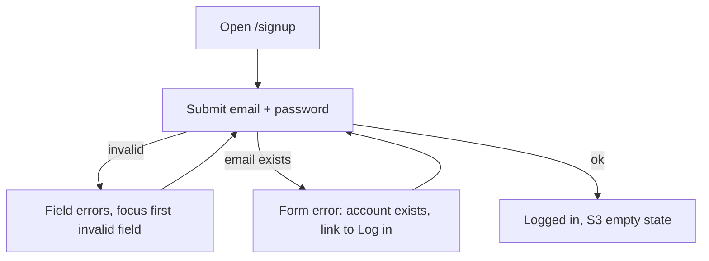
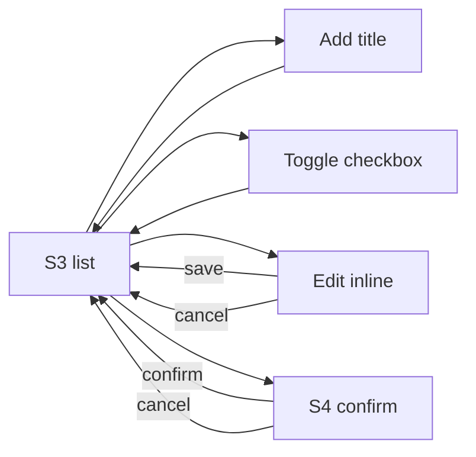

# UX Specification: To-Do App
> Owner: ux-designer · Source: `docs/PRD.md` (Approved, Gate 1) · Status: Approved (Gate 2, 2026-10-03)

Defaults from Gate 1 apply: password min 8 chars (no complexity rules), 7-day session, title max 200 chars, confirm before delete, no password reset, no email verification, responsive web, name "To-Do App". No tech stack is chosen here; components are described generically so any standard component library can supply them.

## 1. Screen inventory and story mapping

| ID | Screen | Route (suggested) | Stories |
|---|---|---|---|
| S1 | Sign up | `/signup` | US-1 |
| S2 | Log in | `/login` | US-2 |
| S3 | To-do list (main app) | `/` | US-3, US-4, US-5, US-6, US-7, US-8, US-9 |
| S4 | Delete confirmation (modal dialog) | overlay on S3 | US-8 |
| S5 | Session-expired state (handled on S2 with a banner) | `/login` | US-2, US-9 |
| S6 | Not found / generic error page | any | none (support state) |

US-9 (privacy) has no dedicated screen. Its UX consequences: all to-do routes require login, other users' data is never shown, and a request for a to-do that is not yours looks identical to "not found" (see 5.5).

## 2. User flows

### 2.1 Sign up (US-1)
1. Visitor opens `/signup` (or follows "Sign up" from S2).
2. Enters email and password, submits "Create account".
3. Client-side checks run on submit (empty, email format, password length). Failures show field errors; focus moves to the first invalid field.
4. Server check: if the email already exists, show the form-level error for duplicate email. No second account is created.
5. Success: user is logged in and lands on S3 in the empty state, with focus on the new-to-do input.



### 2.2 Log in (US-2)
1. Visitor opens `/login`, or is redirected there when opening any protected URL while logged out. The original URL is not required to be restored (see Open questions).
2. Enters email and password, submits "Log in".
3. Wrong email or wrong password: one generic form-level error, fields keep the email value, password is cleared, focus goes to the error summary.
4. Success: land on S3.
5. Returning within 7 days: visiting `/` shows S3 directly; no login required.
6. Logged-in user who opens `/login` or `/signup` is redirected to S3.

### 2.3 Log out (US-3)
1. User activates "Log out" in the header of S3.
2. Session ends immediately (no confirmation step; it is low-risk and reversible by logging in).
3. User lands on S2 with a status message "You have been logged out."
4. Browser Back or a direct request to `/` must not reveal to-dos; the user is redirected to S2. (Engineering note: protected pages must not be served from cache after logout.)

### 2.4 To-do CRUD (US-4 to US-8)
- **Create (US-4):** type a title in the "Add a to-do" field at the top of S3, press Enter or "Add". Valid: new item appears at the top of the list as incomplete, field clears, focus stays in the field for fast repeat entry. Invalid (empty/whitespace/over 200): inline error under the field, nothing created, typed text kept.
- **List (US-5):** S3 shows all of the user's to-dos newest first, each with checkbox, title, and actions. Empty list shows the empty state.
- **Toggle (US-6):** activate the checkbox. The item switches to the complete style (strikethrough plus a check) and the change persists. On failure the checkbox reverts and an error message is shown.
- **Edit (US-7):** activate "Edit" on an item; the title becomes an inline text field prefilled with the current title and focus moves into it. Enter or "Save" commits; Escape or "Cancel" discards. Invalid (empty or over 200): inline error, old title kept (the field retains the user's attempted text so they can fix it; Cancel restores the old title). On success focus returns to that item's Edit button.
- **Delete (US-8):** activate "Delete" on an item, S4 opens. "Delete" confirms and the item is removed; "Cancel" (or Escape) closes with no change. After deletion focus moves to the next item's checkbox, or the previous item's, or the add field if the list is now empty.



### 2.5 Session expiry handling (US-2, US-9)
Sessions last 7 days. When any request from S3 returns "unauthenticated":
1. The app stops showing stale data actions and redirects to S2 with the banner "Your session has expired. Please log in again." (S5).
2. Any unsaved text in the add or edit field is lost; this is acceptable for MVP (single short title).
3. After logging in again the user lands on S3.
4. Expiry found on page load (opening the app after 7 days) behaves the same: redirect to S2 with the same banner.
5. Logout and expiry are distinguishable by message only; both land on S2.

## 3. Screen specs

Shared: single column, centered, max content width 480 px on auth screens and 720 px on the list. Page title (document `<title>`) and a single `<h1>` per screen. Product name "To-Do App" appears in the header.

### S1 Sign up (US-1)
**Purpose:** create an account.

```
+------------------------------------------+
|  To-Do App                                |
+------------------------------------------+
|                                          |
|        Create your account                |   <h1>
|                                          |
|   [ error summary, only when errors ]    |
|                                          |
|   Email                                  |
|   [______________________________]      |
|   (field error)                          |
|                                          |
|   Password                               |
|   [____________________] [Show]          |
|   At least 8 characters.                 |
|   (field error)                          |
|                                          |
|   [        Create account          ]     |
|                                          |
|   Already have an account? Log in        |
+------------------------------------------+
```

**Components:** text input (type email, autocomplete `email`), password input (autocomplete `new-password`) with Show/Hide toggle, primary button, text link, error summary, field-level error text.
**States:**
- Default: empty fields, helper text under password.
- Submitting: button disabled, label "Creating account...", `aria-busy` on form. Prevent double submit.
- Field error: red text plus icon under the field, field border changes, `aria-invalid="true"`, error linked via `aria-describedby`.
- Duplicate email: form-level error above the form (and field error is not used, to keep it simple).
- Network/server error: form-level error "Something went wrong. Please try again."
- Success: redirect to S3.

### S2 Log in (US-2, US-3 landing, session expiry)
**Purpose:** authenticate an existing user; landing page after logout and expiry.

```
+------------------------------------------+
|  To-Do App                                |
+------------------------------------------+
|        Log in                             |   <h1>
|   [ status banner: logged out / expired ]|
|   [ error: invalid email or password   ] |
|                                          |
|   Email                                  |
|   [______________________________]      |
|   Password                               |
|   [____________________] [Show]          |
|                                          |
|   [            Log in              ]     |
|                                          |
|   New here? Create an account            |
+------------------------------------------+
```

**Components:** same as S1 plus status/info banner (`role="status"`) and error banner (`role="alert"`).
**States:**
- Default; submitting (button "Logging in...", disabled).
- Invalid credentials: generic error, never says which of email or password was wrong. Password cleared; email kept.
- Empty/invalid-format fields: field-level errors as in S1 (no credential check is made).
- Logged-out banner (info) and session-expired banner (warning).
- Network/server error: "Something went wrong. Please try again."
- No "Forgot password" link (out of MVP; see Open questions).

### S3 To-do list (US-3 to US-9)
**Purpose:** the whole app: add, view, complete, edit, delete, log out.

```
+--------------------------------------------------------+
| To-Do App                    sam@example.com [Log out] |  <header>
+--------------------------------------------------------+
|  My to-dos                                              |  <h1>
|                                                        |
|  [ Add a to-do...                      ] [ Add ]       |
|  (field error)                                         |
|                                                        |
|  [ page-level error / retry, when needed ]             |
|                                                        |
|  ( ) Buy milk                         [Edit] [Delete]  |
|  (x) ~~Pay rent~~                     [Edit] [Delete]  |
|  ( ) Call mom                         [Edit] [Delete]  |
+--------------------------------------------------------+
```

Edit mode of one row:
```
|  [ Buy oat milk                     ] [Save] [Cancel]  |
|  (field error)                                         |
```

**Components:** app header with the user's email (as identification of who is logged in) and Log out button; text input + primary button (add); list of items (`<ul>`), each with checkbox, title text, Edit and Delete buttons; inline edit field with Save/Cancel; error banner with Retry; loading skeleton; empty state; S4 modal.
**Ordering:** newest first (creation time). Completing an item does not move it.
**Character counter:** shown only when the entered length is 180 or more, as "N / 200", to avoid clutter. Long titles wrap onto multiple lines (no truncation).

**States:**
- *Loading (initial fetch):* three skeleton rows, the list container has `aria-busy="true"`, and a visually hidden "Loading your to-dos" status. The add field is already usable.
- *Empty (US-5):* replaces the list with a message and prompt (see copy). Focus is not stolen on load, except directly after sign up where focus goes to the add field.
- *Populated:* list as above.
- *Load error:* in place of the list, an error banner with "Try again" button.
- *Action error (create, toggle, edit, delete failed):* inline or banner message; state reverts to what the server has; the user's typed text is kept where applicable.
- *Item pending:* while an action is in flight, that item's controls are disabled (`aria-disabled`/disabled) to prevent double actions.
- *Success feedback:* the visible change in the list is the primary feedback; a polite live region also announces it (see copy and Accessibility). No toast is required.
- *Unauthenticated:* see 2.5.

**Privacy (US-9):** only the user's own items are ever rendered. If a direct link or action targets an item that is not theirs, the UI shows the same message as for a missing item (see S6 and 5.5). There is no way in the UI to view another user's data, and no user IDs are shown.

### S4 Delete confirmation (US-8)
**Purpose:** confirm destructive action.

```
+-----------------------------------------+
|  Delete this to-do?                  [x]|  <h2 id>, close
|                                         |
|  "Buy milk" will be permanently         |
|  deleted. This cannot be undone.        |
|                                         |
|              [ Cancel ]  [ Delete ]     |
+-----------------------------------------+
```

**Components:** modal dialog (`role="dialog"` / `alertdialog`, `aria-modal`), title, description naming the item, secondary Cancel button, destructive-styled Delete button, optional close icon.
**Behaviour:** initial focus on Cancel (the safe option). Focus is trapped inside; Escape and Cancel close it and return focus to the Delete button that opened it; clicking the backdrop also cancels. Page behind is inert.
**States:** default; deleting (Delete button disabled with label "Deleting..."); error (message inside the dialog "Could not delete this to-do. Please try again." and the dialog stays open).

### S5 Session-expired state
Not a separate page: S2 with the warning banner "Your session has expired. Please log in again." (see S2 states and 2.5).

### S6 Not found / error page (support state)
Simple page with `<h1>`, message, and a link to S3 (or S2 if logged out). Used for unknown URLs and for any attempt to open a resource the user does not own.

## 4. Component inventory

| Component | Used on | Notes |
|---|---|---|
| App header (name, user email, Log out) | S3 (name only on S1, S2, S6) | Log out is a button |
| Text input with label, helper, error | S1, S2, S3 | Visible label always on S1 and S2 |
| Password input with Show/Hide toggle | S1, S2 | Toggle is a button with `aria-pressed` |
| Primary button, secondary button, destructive button, icon-less text button | all | States: default, hover, focus, disabled, busy |
| Text link | S1, S2, S6 | |
| Error summary / form-level alert | S1, S2 | `role="alert"` |
| Field error text | S1, S2, S3 | Icon plus text, never color only |
| Info / warning banner | S2, S3 | `role="status"` (info), `role="alert"` (error) |
| Checkbox | S3 rows | Native checkbox semantics |
| To-do row (view and edit modes) | S3 | |
| Empty state block | S3 | |
| Skeleton loader | S3 | Respect reduced motion |
| Modal dialog | S4 | Focus trap, Escape |
| Live region (polite) | S3 | Visually hidden announcements |

Prefer a well-known accessible component library for dialog, checkbox and focus management rather than custom builds; the choice is for the Architect/Tech Lead.

## 5. UI copy

### 5.1 General
| Where | Copy |
|---|---|
| Product name | To-Do App |
| Sign up h1 | Create your account |
| Sign up submit | Create account |
| Sign up submitting | Creating account... |
| Sign up switch link | Already have an account? Log in |
| Log in h1 | Log in |
| Log in submit / submitting | Log in / Logging in... |
| Log in switch link | New here? Create an account |
| Email label | Email |
| Password label | Password |
| Password helper (sign up only) | At least 8 characters. |
| Show / Hide password | Show / Hide |
| Header log out | Log out |
| List h1 | My to-dos |
| Add field label (visible-hidden allowed) | Add a to-do |
| Add field placeholder | What needs doing? |
| Add button | Add |
| Item buttons | Edit, Delete (accessible names include the title, e.g. "Edit Buy milk") |
| Edit buttons | Save, Cancel |
| Checkbox accessible name | The to-do title (state is announced by the checkbox) |

### 5.2 Validation messages
| Condition | Message |
|---|---|
| Email empty | Enter your email address. |
| Email invalid format | Enter a valid email address, like name@example.com. |
| Password empty | Enter a password. |
| Password under 8 chars (sign up) | Password must be at least 8 characters. |
| Title empty or whitespace only (add and edit) | Enter a title for your to-do. |
| Title over 200 chars | Title must be 200 characters or fewer. |
| Error summary heading (sign up/log in with multiple errors) | Please fix the following: |

On log in, only "empty" checks are done client-side. Password-length and complexity are not checked at log in, so that a message never hints at rules to an attacker.

### 5.3 Server / system errors
| Condition | Message |
|---|---|
| Duplicate email on sign up | An account with this email already exists. Log in instead. ("Log in" is a link.) |
| Wrong email or password | Invalid email or password. |
| Generic failure on submit | Something went wrong. Please try again. |
| Network offline | You appear to be offline. Check your connection and try again. |
| Rate limited, if the server does so | Too many attempts. Please wait a moment and try again. |
| Session expired | Your session has expired. Please log in again. |
| Load to-dos failed | We could not load your to-dos. (Button: Try again) |
| Create failed | Could not add your to-do. Please try again. |
| Toggle failed | Could not update this to-do. Please try again. |
| Edit failed | Could not save your changes. Please try again. |
| Delete failed | Could not delete this to-do. Please try again. |
| Not found (also for another user's item) | We could not find that page. (Link: Go to my to-dos) |

### 5.4 Status, empty, loading, confirmation
| Where | Copy |
|---|---|
| After logout (on S2) | You have been logged out. |
| Empty state heading | No to-dos yet |
| Empty state body | Add your first task above to get started. |
| Loading (hidden live text) | Loading your to-dos |
| Delete dialog title | Delete this to-do? |
| Delete dialog body | "{title}" will be permanently deleted. This cannot be undone. |
| Delete dialog buttons | Cancel / Delete (busy: Deleting...) |
| Character counter | {n} / 200 |
| Live announcements (polite) | "To-do added." / "{title} marked complete." / "{title} marked incomplete." / "To-do updated." / "To-do deleted." |

### 5.5 Copy rules
Plain, short, no blame, say what to do next. Never reveal whether an email is registered at log in. (Sign up necessarily reveals duplicates per the PRD acceptance criteria; see Open questions.) Never show internal error codes or IDs.

## 6. Responsive behaviour

Breakpoints (suggested): mobile under 600 px, tablet 600 to 959 px, desktop 960 px and up. Design mobile first. No horizontal scroll at 320 px width and at 400% zoom.

| Aspect | Mobile (under 600) | Tablet / desktop |
|---|---|---|
| Layout | Single column, 16 px side padding | Centered column, max 480 (auth) / 720 (list) |
| Header | Name left, Log out right; email hidden below 400 px (still available to screen readers) | Name left, email + Log out right |
| Add form | Input full width, Add button full width below it | Input and Add button on one row |
| To-do row | Checkbox + title on top (wrapping); Edit and Delete as buttons on a second line, right-aligned | One row: checkbox, title, buttons at right |
| Edit mode | Input full width; Save and Cancel below | Inline on one row |
| Delete dialog | Full-width, anchored near bottom or centered with 16 px margin; buttons stacked full width, Delete last | Centered, 420 px wide, buttons right-aligned |
| Touch targets | Minimum 44 x 44 px for checkbox hit area and all buttons | Minimum 24 x 24 px (WCAG), 40 px recommended |
| Input font size | At least 16 px, so mobile browsers do not zoom on focus | Same |

Text may be resized to 200% without loss of content or function. Use relative units for type and spacing.

## 7. Design tokens (suggestion)

Tokens are names and values only, independent of any framework.

**Color (light theme only; dark mode is Later)**
| Token | Value | Use | Contrast note |
|---|---|---|---|
| `color.bg` | #FFFFFF | page background | |
| `color.surface` | #F6F7F9 | cards, skeleton | |
| `color.text` | #1A1D21 | body | 16:1 on bg |
| `color.text-muted` | #4B5563 | helper, completed titles | 7.5:1 on bg |
| `color.border` | #6B7280 | input borders | at least 3:1 on bg (WCAG 1.4.11) |
| `color.primary` | #1D4ED8 | primary button, links, focus ring base | 6.7:1 on white |
| `color.primary-text` | #FFFFFF | text on primary | 6.7:1 |
| `color.danger` | #B42318 | errors, destructive button | 6.5:1 on white |
| `color.warning-bg` / `color.warning-text` | #FFF4E5 / #7A4100 | session expired | above 7:1 |
| `color.success` | #1B6E3C | reserved, not needed in MVP | 5.8:1 |
| `color.focus` | #1D4ED8 with 2 px white offset | focus ring | 3:1 or more against adjacent colors |

Values should be verified with a contrast checker once implemented.

**Typography:** system font stack (no web fonts, faster and free). Base 16 px / line-height 1.5. h1 28 px (24 on mobile) bold; h2 20 px; small/helper 14 px; button 16 px medium. Completed titles: `text-decoration: line-through` plus muted color.

**Spacing (4 px scale):** 4, 8, 12, 16, 24, 32, 48. Form field gap 16; section gap 24; row padding 12 vertical.

**Other:** radius 6 px (inputs, buttons), 12 px (dialog); border 1 px; focus ring 2 px solid with 2 px offset; dialog backdrop rgba(0,0,0,0.5); transitions 150 ms, disabled when the user prefers reduced motion.

## 8. Accessibility (WCAG 2.1 AA)

**Structure and labels**
- Each screen: `<html lang="en">`, unique descriptive `<title>`, one `<h1>`, landmarks (`header`, `main`).
- Every input has a programmatically associated visible label (S1, S2); the add field has a label (visually hidden allowed) plus placeholder as a hint only. Placeholder is never the only label.
- Use correct autocomplete tokens (`email`, `current-password`, `new-password`) for WCAG 1.3.5.
- Buttons are real buttons and links are real links. Icon-only controls (Show/Hide, dialog close) have accessible names.
- To-do items are in a list; per-item buttons have unique accessible names including the title.

**Keyboard**
- Everything operable by keyboard in a logical tab order that matches the visual order. No keyboard traps except the intentional dialog trap, which Escape exits.
- Enter submits the sign up, log in and add forms, and saves in edit mode. Escape cancels edit mode and closes the dialog. Space toggles checkboxes.
- Visible focus indicator on every focusable element (2.4.7), not obscured by sticky headers.
- Focus management: after failed submit, focus moves to the error summary (S1, S2) or the first invalid field; after add, focus stays in the add field; after entering edit mode, focus in the field; after Save/Cancel, back to the Edit button; dialog open to Cancel, dialog close back to the invoker; after delete, to the neighbouring item or add field; after login/sign up, to the page `<h1>` or the add field on the empty state.

**Errors and announcements**
- Errors are identified in text, not by color alone (3.3.1), include an icon, are tied to fields via `aria-describedby`, and the field has `aria-invalid="true"`. Errors give a suggestion on how to fix (3.3.3).
- Form-level errors use `role="alert"`. Success and status messages (added, completed, updated, deleted, logged out, loading) use a polite live region (`role="status"`) and do not move focus (4.1.3).
- The live region exists in the DOM before messages are inserted.
- Loading state sets `aria-busy` and announces once, not repeatedly.

**Visual**
- Text contrast at least 4.5:1 (3:1 for large text); UI component and focus indicator contrast at least 3:1 (1.4.3, 1.4.11). Completion state is conveyed by checkbox state, strikethrough and muted color together, not color alone (1.4.1).
- Reflow at 320 px and zoom to 400% without two-dimensional scrolling (1.4.10); text spacing overrides do not break layout (1.4.12); no fixed-height containers that clip text.
- Respect `prefers-reduced-motion`; no auto-moving content or timeouts shorter than the 7-day session. The session expiry notice is not time-pressured.
- Touch targets as per section 6.

**Dialog:** `role="dialog"` (or `alertdialog`) with `aria-labelledby` (title) and `aria-describedby` (body), `aria-modal="true"`, background inert.

**Testing expectations (for QA/Frontend):** keyboard-only pass of each flow, automated axe-style scan with zero serious/critical issues, screen reader smoke test of sign up, add, toggle and delete (at least one desktop and one mobile reader), and a 320 px / 200% zoom check.

(Note: the role instructions mention WCAG 2.2 AA; the task specifies 2.1 AA. The design also satisfies the relevant 2.2 items: focus not obscured, target size minimum 24 px, no dragging required, no cognitive-test authentication. Treat 2.2 as a bonus, not a gate.)

## 9. Open questions

1. **Return-to-URL after login:** should a user redirected from a protected URL be sent back to it after login? Proposal: not in MVP, since the only protected page is `/`. No action needed unless more pages are added.
2. **Duplicate email message on sign up:** the PRD requires an error for duplicate emails, which reveals that an email is registered (account enumeration). With no email verification this is unavoidable; confirm that CEO and Security accept it. Optionally, rate-limit sign up (Architect).
3. **Locked-out users:** with no password reset (Gate 1), a forgotten password means permanent lockout. S2 has no "Forgot password" link. Should the copy mention this, or should the CEO pull reset into the next sprint? Proposed: no mention in MVP.
4. **Show the user's email in the header:** not in the PRD, added as a low-cost identity cue on shared devices. Confirm or drop; it does not affect any story.
5. **Character counter at 180+ chars and polite live announcements:** small additions for usability and accessibility, not PRD requirements. Drop the counter if it is considered scope creep.
6. **Edit trigger:** explicit Edit button (chosen, best for keyboard and touch) versus double-click on the title. Proposed: button only.
7. **Rate limiting / lockout on log in:** not in the PRD. The "Too many attempts" copy is reserved in case the Architect or Security adds it; remove if not.
8. **Maximum number of to-dos and pagination:** the PRD does not limit them. The list is designed as one unpaginated list; the Architect should confirm that is acceptable for the expected scale (a few hundred users).
9. **Sign-up password confirmation field:** not included (a Show/Hide toggle is used instead). Confirm.
10. **Logout when the network is offline:** behaviour not defined. Proposed: still clear local state and go to S2; server-side session invalidation is the Architect's concern.

## 10. PRD gaps noticed
- No requirement for what happens to unsaved input on session expiry (assumed lost; see 2.5).
- US-9 states that guessing another user's ID is rejected but does not say what the user sees; proposed the same "not found" page (S6).
- Completed items' sort position is not specified; assumed they keep their newest-first position.
- No requirement for a "clear completed" or counts (not added).
